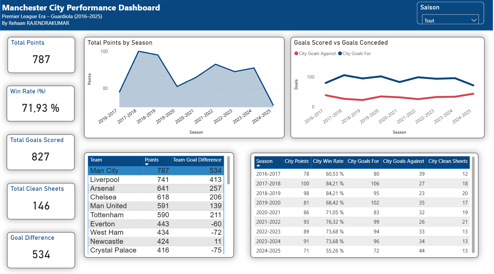
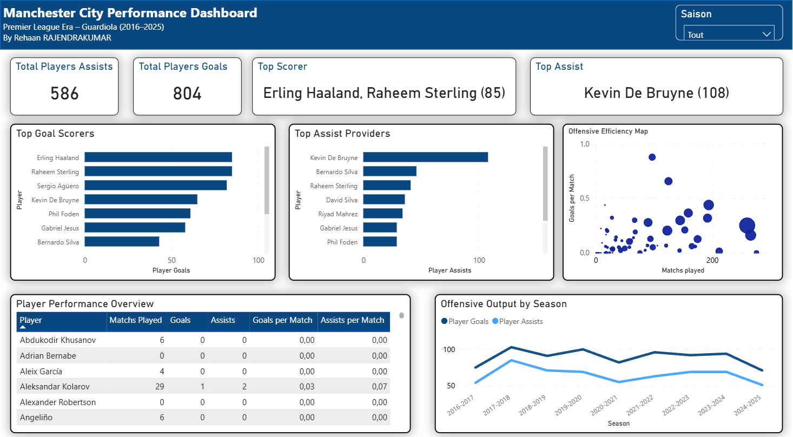
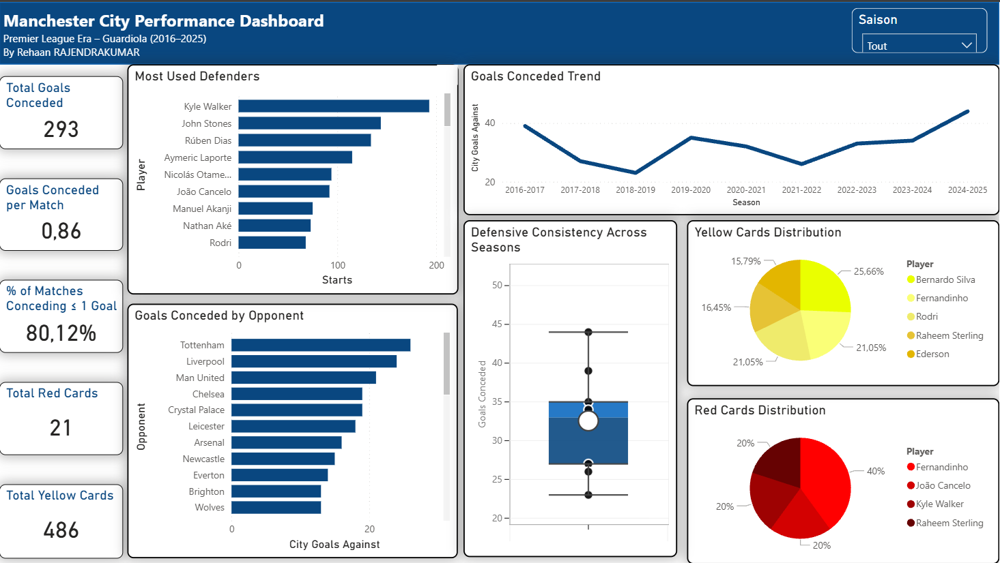

# Manchester City – Tableau de bord de performance (2016–2025)

Ce projet consiste en la création d’un tableau de bord interactif sous Power BI analysant les performances de Manchester City en Premier League durant la période 2016–2025 (ère Pep Guardiola).

L’objectif est de proposer une analyse claire et structurée des performances de l’équipe sur plusieurs saisons, en combinant indicateurs globaux, analyse offensive et analyse défensive.

---

## Objectifs du projet

- Étudier l’évolution des performances saison après saison  
- Mesurer l’efficacité offensive et la solidité défensive  
- Identifier les joueurs les plus décisifs  
- Analyser la régularité défensive  
- Examiner la discipline à travers les cartons jaunes et rouges  

---

## Contenu du tableau de bord

Le dashboard est organisé en trois pages principales :

### 1. Vue d’ensemble

- Points totaux  
- Différence de buts  
- Taux de victoire  
- Évolution des performances par saison  
- Comparaison buts marqués / buts encaissés  

Cette page permet d’avoir une vision globale de la performance du club sur la période étudiée.

---

### 2. Analyse offensive

- Classement des meilleurs buteurs  
- Classement des meilleurs passeurs  
- Moyenne de buts par match  
- Moyenne de passes décisives par match  
- Carte d’efficacité offensive (relation entre temps de jeu et performance)  

Cette section met en évidence les joueurs les plus influents et la constance de la production offensive.

---

### 3. Analyse défensive

- Évolution des buts encaissés par saison  
- Distribution des buts encaissés (analyse de variabilité)  
- Taux de stabilité défensive (pourcentage de matchs avec 0 ou 1 but encaissé)  
- Défenseurs les plus utilisés  
- Répartition des cartons jaunes et rouges par joueur  

Cette partie permet d’évaluer la solidité défensive et la discipline de l’équipe.

---

## Méthodologie

Le projet repose sur :

- La modélisation des données dans Power BI  
- La création de mesures dynamiques en DAX  
- La construction d’indicateurs synthétiques (KPI)  
- L’utilisation de visualisations adaptées pour faciliter la lecture des résultats  

L’objectif était de produire un outil interactif, lisible et orienté analyse, plutôt qu’un simple affichage de statistiques.

---

## Outils utilisés

- Power BI  
- DAX  
- Modélisation de données  
- Visualisation interactive  

---

## Accès au tableau de bord

Lien vers le dashboard interactif :  
[Dashboard](https://app.powerbi.com/reportEmbed?reportId=fda1e3a7-1d89-45e3-b92f-67e66603dc24&autoAuth=true&ctid=88eebcae-d6e6-4ef7-bba4-4c34f4c2d5e0)

---
## Aperçu du tableau de bord

### Vue d’ensemble

### Analyse offensive

### Analyse défensive

---
## Auteur

Rehaan Rajendrakumar  
ESILV – Parcours Data & IA  
Projet réalisé en 2026
